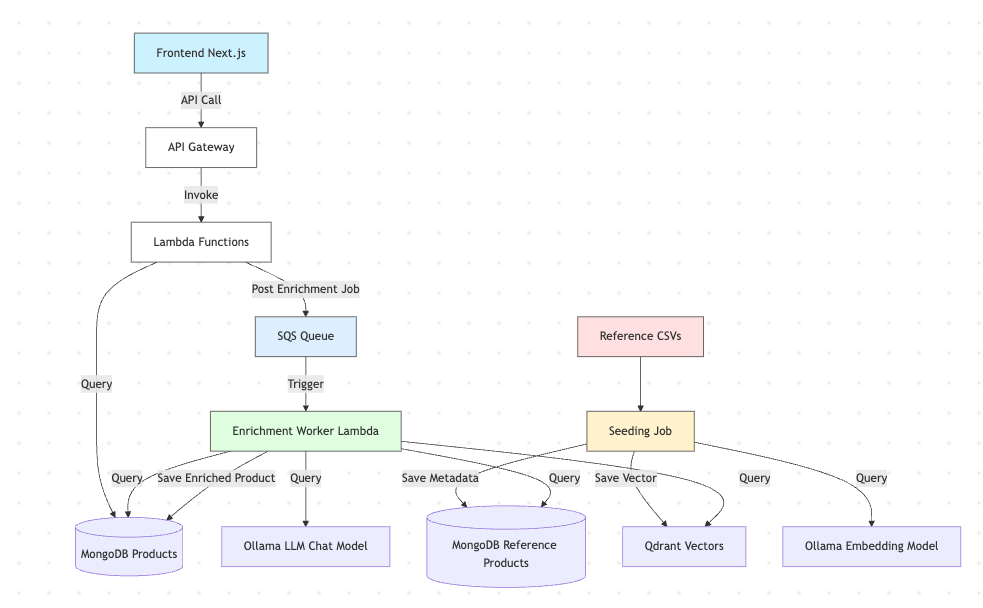

# enrich-product-backend

> Backend portion of the enrichment product system.  
> Provides APIs and processing logic to connect to MongoDB, Qdrant, and LLMs for product data enrichment.

---

## Table of Contents

- [Tech Stack](#tech-stack)
- [Installation](#installation)
- [Features](#features)
- [Architecture](#architecture)
- [Project Structure](#project-structure)
- [API Documentation](#api-documentation)
- [Technical Decisions and Tradeoffs](#technical-decisions-and-tradeoffs)
- [Technical Limitations](#technical-limitations)
- [Learnings](#learnings)
- [Future Enhancements](#future-enhancements)
- [Data Sources](#data-sources)
- [License](#license)
- [Notes](#notes)
- [Testing](#testing)

---

## Tech Stack

- **Node.js** v22.6.0
- **MongoDB** (Replica Set, Local via Docker)
- **Qdrant** (Vector Search Engine)
- **Ollama** (Local LLM and Embeddings)
- **ElasticMQ** (Local SQS-compatible queue service for offline development)

---

## Installation

### Prerequisites

- Docker installed
- Node.js v22.6.0 (recommend using [nvm](https://github.com/nvm-sh/nvm))

### Setup Steps

1. **Install MongoDB via Docker with Replica Set:**

```bash
docker run -d --name mongodb \
  -p 27017:27017 \
  --restart unless-stopped \
  mongo --replSet rs0
```

2. **Initiate the Replica Set:**

```bash
docker exec -it mongodb mongosh
```

Inside:

```javascript
rs.initiate();
cfg = rs.conf();
cfg.members[0].host = "localhost:27017"; // or your machine IP
rs.reconfig(cfg, { force: true });
```

3. **Install Qdrant via Docker:**

```bash
docker run -d --name qdrant -p 6333:6333 qdrant/qdrant
```

4. **Install Ollama via Docker:**

```bash
docker run -d --name ollama -p 11434:11434 ollama/ollama
```

5. **Install ElasticMQ for Local SQS Emulation:**

```bash
docker run -d --name elasticmq -p 9324:9324 softwaremill/elasticmq
```

6. **Load Required Models into Ollama:**

```bash
curl http://localhost:11434/api/pull -d '{"name": "llava"}'
curl http://localhost:11434/api/pull -d '{"name": "nomic-embed-text"}'
```

7. **Clone the Repository:**

```bash
git clone https://github.com/jfaylon/enrich-product-backend.git
cd enrich-product-backend
```

8. **Install Dependencies:**

```bash
npm install
```

9. **Set up Environment Variables:**

```bash
cp .env.example .env
```

Edit `.env` with your configuration values.

10. **Run Migrations and Seed Data:**

```bash
npm run migrate up
```

11. **Start the Development Server:**

```bash
npm run dev
```

---

## Features

- Product ingestion and enrichment using LLMs
- Vector similarity search using Qdrant
- MongoDB structured storage with replica set support
- Batch seeding of Amazon and Food datasets
- Local serverless development supported using serverless-offline for Lambda simulation
- Local SQS queue emulation supported using ElasticMQ for background processing
- Modular and scalable backend architecture

---

## Architecture



There are 3 major flows that are identified: User flow, Enrichment worker flow, and seeding flow.

- The user flow is able to manage products and attributes, and sends a job to the queue for product enrichment
- The enrichment worker flow performs the vector search, prompt generation, LLM query, and processing of results
- The seeding flow adds reference products for possible similarities that can be used for better product enrichment.

---

## Project Structure

```bash
/assets             # Sample assets like CSV/XLSX files for uploads
/seeds              # Seed data files for initializing collections (e.g., ReferenceProducts)
/mongo-migrate-ts
  /migrations       # MongoDB migration and seed scripts
/src
  /handlers         # Lambda handlers (API entry points)
  /interfaces       # TypeScript interfaces and shared types
  /llms             # LLM service logic (e.g., Ollama adapters)
  /mappers          # Data mappers to normalize external sources
  /models           # MongoDB Mongoose schemas
  /public           # Static public files (e.g., Swagger UI)
  /services         # Core business logic (e.g., ProductService, AttributeService)
  /utils            # Shared utility functions (e.g., logging, retry logic)
/test               # Unit tests and test utilities
```

---

## API Documentation

- When the serverless framwork is running, it can be viewed at this [http://localhost:3000/swagger](http://localhost:3000/swagger)
- Note: port 3000 is the default port. Please confirm what port have you set it up with

- Here is a concise table of API calls

## API Documentation

| Method | Endpoint                                              | Notes                                  |
|:-------|:------------------------------------------------------|:---------------------------------------|
| POST   | http://localhost:3000/products                        | Upload products (CSV/XLSX)             |
| POST   | http://localhost:3000/products/enrich                 | Trigger enrichment for selected products |
| GET    | http://localhost:3000/products                        | List products with filtering/sorting  |
| DELETE | http://localhost:3000/products                        | Delete selected products              |
| GET    | http://localhost:3000/attributes                      | List attributes                       |
| POST   | http://localhost:3000/attributes                      | Create a new attribute                |
| DELETE | http://localhost:3000/attributes/{attributeId}        | Delete an attribute                   |
| GET    | http://localhost:3000/swagger                         | Swagger UI HTML page                  |
| GET    | http://localhost:3000/swagger.json                    | Raw Swagger JSON spec                 |

---

## Technical Decisions and Tradeoffs

### NoSQL (MongoDB) vs SQL

MongoDB was selected over traditional SQL databases to handle flexible and evolving product schemas, particularly those involving user-defined dynamic attributes. The document-oriented model of MongoDB enables rapid iteration and efficient storage and querying of nested, semi-structured data without requiring rigid, predefined schemas. This flexibility is critical for supporting dynamic, user-generated attributes that can vary significantly between products.

In terms of scaling, NoSQL databases like MongoDB are inherently better suited for horizontal scaling, where new nodes can be added easily to expand storage and performance. In contrast, traditional SQL databases typically scale vertically, requiring larger, more powerful servers — a process that can involve significant downtime and infrastructure complexity when upgrading.

From a development perspective, MongoDB also offers advantages such as in-memory database support (e.g., mongodb-memory-server), which enables lightweight, fast, and compatible unit tests without the need for external infrastructure. By contrast, while in-memory SQL databases exist, they can often introduce compatibility issues between testing and production environments.

### Polling vs WebSockets

Polling was initially chosen over WebSocket-based updates for background enrichment jobs to keep the system simpler and more resilient to scale. Polling allows easier load distribution across serverless deployments and is more tolerant of client network inconsistencies compared to maintaining long-lived WebSocket connections.

### Serverless Architecture vs Kubernetes vs Monolithic Backend

The project adopts a **modular serverless-compatible backend design**, aligned with the take-home requirements favoring a serverless approach.  
This enables independent deployment of functions, automatic scaling, and minimizes infrastructure management overhead.

However, alternative architectures such as Kubernetes orchestration or Monolithic hosting were also considered, and each comes with tradeoffs across different operational dimensions.

| Architecture | Pros | Cons |
|:---|:---|:---|
| **Serverless (chosen)** | Lower infrastructure costs at small-to-medium scale. Automatic scaling to demand. Minimal server management. Fast deployment cycles. | Cold starts (for some functions). Harder to optimize performance for long-running processes. |
| **Kubernetes** | Highly customizable scaling and networking. Fine-grained performance control. Good for complex microservices or high-traffic applications. | High operational complexity (cluster management, monitoring, autoscaling). Higher cost at small scale. Slower initial setup. |
| **Monolithic Backend** | Simplest to set up and reason about initially. Fewer moving parts. Good for small teams or MVPs. | Poor scalability. Risk of downtime during deployments. Harder to evolve as the system grows. Single point of failure. |

#### Summary of Architectural Choice

- **Serverless architecture** was chosen to align with the take-home preference, offering fast scalability, cost efficiency, and low operational overhead during early stages of the project.
- **Kubernetes orchestration** is a strong candidate for future evolution if traffic becomes highly variable, multi-region scaling is needed, or performance tuning across services becomes critical.
- **Monolithic backend** approaches, while faster for prototypes, were not selected due to limitations in scaling, deployment flexibility, and maintainability over time.

#### Personal Note

- I like that you can simulate AWS modules in serverless-offline. I was able to architect the solution using AWS components such as SQS and Lambda.


### Local Vector Search vs Managed Solutions

Qdrant was chosen for local vector search to provide full control over vector storage, similarity tuning, and cost optimization, avoiding reliance on managed cloud vector databases during initial development. The downside of this is the data is stored locally and limited by the local system's capacity. For this test, I feel this is sufficient and this can be refactored to support cloud-based solutions

---

## Technical Limitations

### No Account or API Keys Required

This project is designed to run entirely on local resources without requiring any external accounts or API keys. This decision simplifies development setup, avoids rate limiting issues, and ensures full control over data processing.

### Local Model Usage

Ollama is used to run LLM models locally to eliminate dependency on cloud-based paid services. This local-first approach was chosen to avoid unpredictable costs and to ensure the system remains functional offline.

### Enrichment File Size Constraints

For the sake of this test and local development efficiency, only 10,000 rows were uploaded for each reference dataset (10k for Open Food Facts and 10k for Amazon Products). The original datasets contain more than 1 million rows each. Processing the full datasets would require additional memory and storage optimization strategies, which are noted as future scalability considerations.

---

## Learnings

- Transitioned from designing server-based monolithic architectures to adopting a serverless-compatible modular design.
- Gained deeper understanding of handling local-first AI model hosting using Ollama to manage cost and maintain privacy.
- Experienced practical trade-offs between Kubernetes-managed scalable systems and lightweight serverless workflows for faster local development cycles.
- Strengthened skills around deploying local vector search using Qdrant.

---

## Future Enhancements

- Expand and harden unit testing to include broader edge cases, invalid input handling, and simulated service failures to further improve reliability and fault tolerance.
- Support ingestion of multiple types of reference products by allowing flexible CSV mapping into the system's schema.
- Introduce a dedicated vector database or indexing strategy specifically for barcode-based similarity and retrieval.
- Develop a more dynamic and customizable prompting system based on product attributes and user-defined configurations.
- Implement a feedback system to improve LLM enrichment outputs and allow users to retry enrichments with additional prompt guidance.
- Implement a caching layer (e.g., Redis) for embeddings and enrichment statuses to optimize performance at scale.
- Set up system monitoring tools (e.g., Prometheus, Grafana, Sentry) to observe API response times, database operations, and background processing metrics.
- Finalize Serverless Framework configuration for production-ready cloud deployment (e.g., AWS Lambda, API Gateway).
- Transition background task queue from ElasticMQ (local) to AWS SQS in production environments.

---

## Data Sources

- [Amazon Product Dataset](https://www.kaggle.com/datasets/): Used for initial seeding of reference product information.
  - Products: [https://www.kaggle.com/datasets/asaniczka/amazon-products-dataset-2023-1-4m-products?select=amazon_products.csv](https://www.kaggle.com/datasets/asaniczka/amazon-products-dataset-2023-1-4m-products?select=amazon_products.csv)
- [Open Food Facts](https://world.openfoodfacts.org/): Used for food-related product enrichment.
  - Page: [https://world.openfoodfacts.org/data](https://world.openfoodfacts.org/data)
  - Link: [https://static.openfoodfacts.org/data/openfoodfacts-mongodbdump.gz](https://static.openfoodfacts.org/data/openfoodfacts-mongodbdump.gz)
- [LoremFlickr](https://loremflickr.com/), [Unsplash](https://source.unsplash.com/), [Picsum](https://picsum.photos/): Used for realistic product images.
- Generated synthetic product datasets for development and testing purposes.

---

## License

This project is licensed under the MIT License.

---

## Notes

- Ensure MongoDB is running with a properly initiated replica set before starting the backend.
- Ensure Ollama is running and both `llava` and `nomic-embed-text` models are pulled locally.
- ElasticMQ should be running if testing background enrichment queues locally.
- This backend is intended to be paired with a frontend (currently in development).
- Designed for local-first development to reduce reliance on cloud services during early stages.
- This was run on Node.js 22.6.0. Other versions of Node.js have not been confirmed to be compatible.

---

## Testing

### Unit Testing Coverage
Basic unit tests have been implemented to validate core service functionalities such as product insertion, retrieval, and background processing. Current coverage focuses on critical success paths and common edge cases, forming a foundation for ensuring baseline functionality.

Due to time constraints and the priority placed on achieving core system functionality, unit test coverage is currently in its initial phase. Planned expansions include broader validation of failure scenarios, invalid input handling, and simulated service errors to further enhance system reliability and fault tolerance.

---
